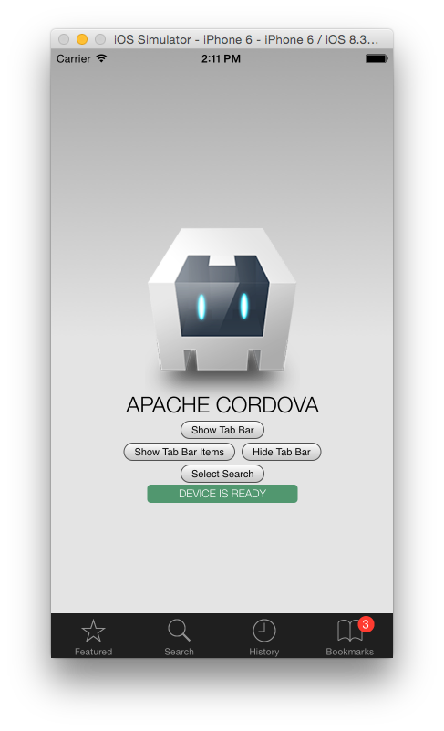

Cordova iOS Tab Bar
===================

Cordova/PhoneGap iOS tab bar plugin for Cordova 5. Forked from https://github.com/tblomseth/cordova-ios-tab-bar which was original based on `Native Controls`.  

This version doesn't have too many changes but I have provided a working [example](/example).  Checkout the [index.js](example/js/index.js) file for how to use the `TabBar` object.

When you are up and running, it will look like this:

If you need to tweak the tab bar colors, there are no options for that yet and you will need to make changes in [CDVTabBar.m](/src/ios/CDVTabBar.m).
