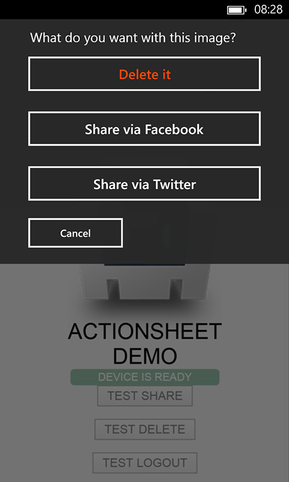
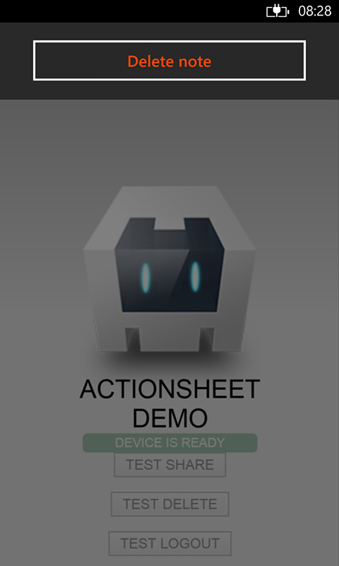
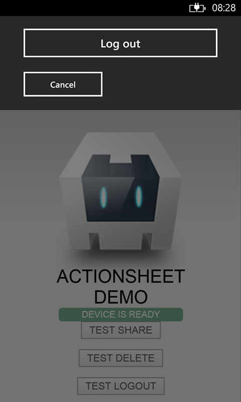

# ActionSheet Cordova / PhoneGap Plugin
by [Eddy Verbruggen](http://twitter.com/eddyverbruggen)

## 0. Index

1. [Description](#1-description)
2. [Screenshots](#2-screenshots)
3. [Installation](#3-installation)
	3. [Automatically (CLI / Plugman)](#automatically-cli--plugman)
	3. [Manually](#manually)
4. [Usage](#4-usage)
5. [Credits](#5-credits)
6. [License](#6-license)

## 1. Description

Show a sheet of options the user can choose from.

* Compatible with [Cordova Plugman](https://github.com/apache/cordova-plugman).
* iOS uses the native `UIActionSheet`.
* Android uses the native `AlertDialog`.
* WP8 uses the native `Popup`.

## 2. Screenshots

iOS

&nbsp;
&nbsp;


Android

&nbsp;
&nbsp;


Windows Phone 8

&nbsp;
&nbsp;


## 3. Installation

### Automatically (CLI / Plugman)
Compatible with [Cordova Plugman](https://github.com/apache/cordova-plugman), compatible with [PhoneGap 3.0 CLI](http://docs.phonegap.com/en/3.0.0/guide_cli_index.md.html#The%20Command-line%20Interface_add_features), here's how it works with the CLI (backup your project first!):

```
$ phonegap local plugin add https://github.com/EddyVerbruggen/cordova-plugin-actionsheet.git
```
or
```
$ cordova plugin add https://github.com/EddyVerbruggen/cordova-plugin-actionsheet
$ cordova prepare
```

ActionSheet.js is brought in automatically. There is no need to change or add anything in your html.

### Manually

1\. Add the following xml to your `config.xml` files:

iOS
```xml
<feature name="ActionSheet">
  <param name="ios-package" value="ActionSheet" />
</feature>
```

Android
```xml
<feature name="ActionSheet">
  <param name="android-package" value="nl.xservices.plugins.actionsheet.ActionSheet"/>
</feature>
```

WP8
```xml
<feature name="ActionSheet">
  <param name="wp-package" value="ActionSheet"/>
</feature>
```

2\. Grab a copy of ActionSheet.js, add it to your project and reference it in `index.html`:
```html
<script type="text/javascript" src="js/ActionSheet.js"></script>
```

3\. Download the source files and copy them to your project.

iOS: Copy the `.h` and `.m` files to `platforms/ios/<ProjectName>/Plugins`

Android: Copy `ActionSheet.java` to `platforms/android/src/nl/xservices/plugins/actionsheet/` (create the folders)

WP8: Copy `ActionSheet.cs` to `platforms/wp8/Plugins/nl.x-services.plugins.actionsheet` (create the folders)

### PhoneGap Build
ActionSheet  works with PhoneGap build too! Just add the following xml to your `config.xml` to always use the latest version of this plugin:
```xml
<gap:plugin name="nl.x-services.plugins.actionsheet" />
```

ActionSheet.js is brought in automatically. Make sure though you include a reference to cordova.js in your index.html's head:
```html
<script type="text/javascript" src="cordova.js"></script>
```

## 4. Usage

### show

Check the [demo code](demo) to get you going quickly,
or copy-paste some of the code below to replicate the ActionSheets of the screenshots above.

```js
  var callback = function(buttonIndex) {
    setTimeout(function() {
      // like other Cordova plugins (prompt, confirm) the buttonIndex is 1-based (first button is index 1)
      alert('button index clicked: ' + buttonIndex);
    });
  };

  function testShareSheet() {
    var options = {
        'androidTheme': window.plugins.actionsheet.ANDROID_THEMES.THEME_HOLO_LIGHT, // default is THEME_TRADITIONAL
        'title': 'What do you want with this image?',
        'buttonLabels': ['Share via Facebook', 'Share via Twitter'],
        'androidEnableCancelButton' : true, // default false
        'winphoneEnableCancelButton' : true, // default false
        'addCancelButtonWithLabel': 'Cancel',
        'addDestructiveButtonWithLabel' : 'Delete it',
        'position': [20, 40] // for iPad pass in the [x, y] position of the popover
    };
    // Depending on the buttonIndex, you can now call shareViaFacebook or shareViaTwitter
    // of the SocialSharing plugin (https://github.com/EddyVerbruggen/SocialSharing-PhoneGap-Plugin)
    window.plugins.actionsheet.show(options, callback);
  };

  function testDeleteSheet() {
    var options = {
        'addCancelButtonWithLabel': 'Cancel',
        'addDestructiveButtonWithLabel' : 'Delete note'
    };
    window.plugins.actionsheet.show(options, callback);
  };

  function testLogoutSheet() {
    var options = {
        'buttonLabels': ['Log out'],
        'androidEnableCancelButton' : true, // default false
        'winphoneEnableCancelButton' : true, // default false
        'addCancelButtonWithLabel': 'Cancel'
    };
    window.plugins.actionsheet.show(options, callback);
  };
```

On iOS, you can also position the actionSheet origin by adding `position: [100, 200]`

### hide

If for some reason you want to hide the actionsheet programmatically, do this:
```js
  // options and callbacks are optional, so either approach will work:
  window.plugins.actionsheet.hide();
  window.plugins.actionsheet.hide({}, onSuccess, onError);
```

## 5. Credits
iOS and WP8 code: [Eddy Verbruggen](https://github.com/EddyVerbruggen)

Android code: mostly [Brill Papping](https://github.com/bpappin)


## 6. Change history
1.1.2 You can now select a theme for your Android popup, see the first example above
1.1.6 You can now set the iOS actionSheet origin position (uses the iOS `actionSheet.showFromRect` method)

## 7. License

[The MIT License (MIT)](http://www.opensource.org/licenses/mit-license.html)

Permission is hereby granted, free of charge, to any person obtaining a copy
of this software and associated documentation files (the "Software"), to deal
in the Software without restriction, including without limitation the rights
to use, copy, modify, merge, publish, distribute, sublicense, and/or sell
copies of the Software, and to permit persons to whom the Software is
furnished to do so, subject to the following conditions:

The above copyright notice and this permission notice shall be included in
all copies or substantial portions of the Software.

THE SOFTWARE IS PROVIDED "AS IS", WITHOUT WARRANTY OF ANY KIND, EXPRESS OR
IMPLIED, INCLUDING BUT NOT LIMITED TO THE WARRANTIES OF MERCHANTABILITY,
FITNESS FOR A PARTICULAR PURPOSE AND NONINFRINGEMENT. IN NO EVENT SHALL THE
AUTHORS OR COPYRIGHT HOLDERS BE LIABLE FOR ANY CLAIM, DAMAGES OR OTHER
LIABILITY, WHETHER IN AN ACTION OF CONTRACT, TORT OR OTHERWISE, ARISING FROM,
OUT OF OR IN CONNECTION WITH THE SOFTWARE OR THE USE OR OTHER DEALINGS IN
THE SOFTWARE.
